# Plan de Gestión de Proyecto de Software (SPMP)
## Estándar IEEE 1058 — "SplitWise Collab / AmigoGasto"

---

**Proyecto:** Plataforma Web Colaborativa de Gestión y Liquidación de Gastos Compartidos  
**Organización:** Equipo de Ingeniería y Calidad de Software — Grupo 5  
**Fecha de Emisión:** 27 de Agosto de 2026  
**Versión:** 1.0.0 (Línea Base Aprobada)  
**Clasificación:** Documentación Formal de Gestión de Proyecto  
**Estado:** Aprobado por el Comité de Dirección y Product Owner  

---

## Control del Documento

| Versión | Fecha | Autor / Rol | Descripción del Cambio | Estado |
| :--- | :--- | :--- | :--- | :--- |
| **0.1.0** | 10/08/2026 | Project Manager / Scrum Master | Estructuración inicial bajo norma IEEE 1058 | En Revisión |
| **0.5.0** | 18/08/2026 | Equipo de Desarrollo & UX/UI | Incorporación de modelos UML, BPMN y arquitectura | Preliminar |
| **0.9.0** | 24/08/2026 | Tester Funcional & QA Lead | Inclusión de Planes SQA, SCM y Matrices de Riesgos | En Aprobación |
| **1.0.0** | 27/08/2026 | Product Owner & Project Manager | Línea base formal aprobada para ejecución en 8 semanas | **Aprobado** |

---

## Tabla de Contenidos
1. [Sección 1: Introducción](#sección-1-introducción)
2. [Sección 2: Organización del Proyecto](#sección-2-organización-del-proyecto)
3. [Sección 3: Procesos Gerenciales](#sección-3-procesos-gerenciales)
4. [Sección 4: Procesos Técnicos](#sección-4-procesos-técnicos)
5. [Sección 5: Planificación de los Recursos](#sección-5-planificación-de-los-recursos)
6. [Sección 6: Planificación de la Calidad (SQA)](#sección-6-planificación-de-la-calidad-sqa)
7. [Sección 7: Planificación de la Comunicación](#sección-7-planificación-de-la-comunicación)
8. [Sección 8: Planificación de los Cambios y Configuración (SCM)](#sección-8-planificación-de-los-cambios-y-configuración-scm)

---

# Sección 1: Introducción

### 1.1 Resumen del Proyecto y Visión
El proyecto **AmigoGasto (SplitWise Collab)** consiste en el diseño, desarrollo, aseguramiento de calidad y despliegue de una aplicación web moderna orientada a la gestión colaborativa, transparente y simplificada de gastos entre grupos de personas (amigos en viajes, compañeros de piso/vivienda compartida, organizadores de eventos sociales o comités de proyectos).

El problema crítico que aborda es la fricción interpersonal, la pérdida de registro financiero y la complejidad matemática al calcular balances cruzados ("quién le debe a quién") tras actividades grupales. La solución implementa un algoritmo determinista de simplificación de deudas (Greedy Debt Settlement / Minimum Cash Flow Flow Network) que minimiza el número total de transacciones requeridas para saldar todas las cuentas grupales.

### 1.2 Entregables del Proyecto (Project Deliverables)
Los entregables contractuales y técnicos distribuidos a lo largo del ciclo de vida de 8 semanas son:
1. **SPMP Formal (IEEE 1058):** Este documento maestro de planificación, gestión y calidad.
2. **Prototipos de Alta Fidelidad en Figma:** Sistema de diseño modular (Design System tokens, UI Kit, flujos de navegación interactivos para Desktop y Mobile Responsive).
3. **Monorepo de Código Fuente:** Repositorio estructurado con Yarn Workspaces conteniendo:
   - Backend en **NestJS** con TypeORM, validación de esquemas y documentación OpenAPI (Swagger).
   - Frontend en **React + Vite** con TailwindCSS, componentes desacoplados listos para integración Figma.
   - Orquestación de infraestructura mediante **Docker Compose** para base de datos MySQL 8.0 aislada.
4. **Plan y Reporte de Aseguramiento de Calidad (SQA & Test Suites):** Casos de prueba funcionales/manuales documentados, pruebas unitarias e integración automatizadas, matriz de trazabilidad de requisitos.
5. **Guía de Despliegue y Manual de Usuario:** Documentación operativa para aprovisionamiento local y en la nube.

### 1.3 Evolución del SPMP
Este documento es un artefacto vivo gestionado bajo control de versiones estricto. Las actualizaciones al SPMP se rigen por las siguientes directivas:
- **Revisiones Planificadas:** Al término de cada Sprint (Sprints 1 a 4) durante la Sprint Retrospective.
- **Revisiones No Planificadas:** Disparadas por cambios de alcance aprobados por el Change Control Board (CCB) o desvíos del cronograma superiores al 10% del esfuerzo estimado.
- **Aprobaciones:** Toda modificación mayor requiere la firma del Product Owner y del Project Manager.

### 1.4 Materiales de Referencia y Normas Aplicadas
- **IEEE Std 1058-1998:** *IEEE Standard for Software Project Management Plans*.
- **IEEE Std 730-2014:** *IEEE Standard for Software Quality Assurance Processes*.
- **IEEE Std 829-2008 / ISO/IEC/IEEE 29119:** *Software and Systems Engineering — Software Testing*.
- **ISO/IEC 25010:2011:** *Systems and software engineering — Systems and software Quality Requirements and Evaluation (SQuaRE) — System and software quality models*.
- **ISO/IEC 12207:2017:** *Systems and software engineering — Software life cycle processes*.
- **Scrum Guide (Noviembre 2020):** Ken Schwaber & Jeff Sutherland.

### 1.5 Definiciones, Acrónimos y Abreviaturas
- **SPMP:** Software Project Management Plan.
- **DoD:** Definition of Done (Criterio de Hecho).
- **DoR:** Definition of Ready (Criterio de Listo para Desarrollar).
- **SQA:** Software Quality Assurance (Aseguramiento de Calidad de Software).
- **SCM:** Software Configuration Management (Gestión de Configuración de Software).
- **CCB:** Change Control Board (Comité de Control de Cambios).
- **UML:** Unified Modeling Language.
- **BPMN:** Business Process Model and Notation.
- **Min Cash Flow:** Algoritmo de minimización de flujo de efectivo para optimización de transferencias.

---

# Sección 2: Organización del Proyecto

### 2.1 Modelo de Proceso: Metodología Ágil Scrum
El proyecto adopta el marco **Scrum** adaptado a un horizonte temporal cerrado de **8 semanas** (dividido en **4 Sprints de 2 semanas cada uno**). Este enfoque garantiza retroalimentación continua, refinamiento constante del Product Backlog, inspección temprana de prototipos y entregas de software funcional potencialmente desplegables al final de cada iteración.

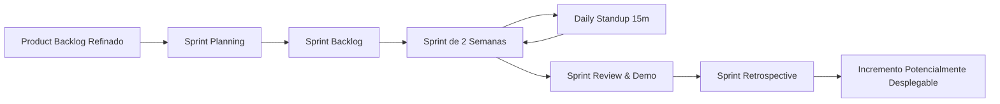

### 2.2 Estructura Organizacional y Organigrama
El equipo de proyecto está compuesto exactamente por **6 profesionales dedicados** con asignaciones claras de responsabilidad:

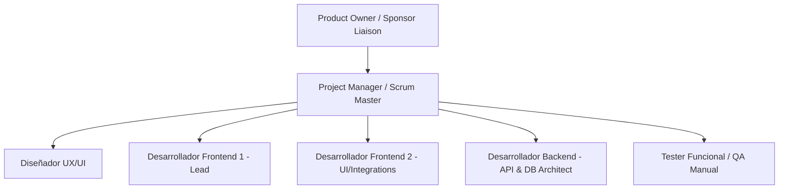

### 2.3 Límites Organizacionales e Interfaces
- **Interfase con Stakeholders / Usuarios Finales:** Canalizada exclusivamente a través del Product Owner (PO) mediante sesiones quincenales de Sprint Review.
- **Interfase de Diseño & Ingeniería:** Sincronización continua entre UX/UI Designer y Frontend Developers mediante sistema de diseño compartido en Figma y tokens CSS/Tailwind.
- **Interfase de Calidad:** El Tester Funcional actúa con independencia técnica evaluando las historias de usuario bajo el Definition of Done (DoD) antes del cierre de cada Sprint.

### 2.4 Matriz RACI de Roles y Responsabilidades
*(R: Responsable de ejecución, A: Aprobador/Accountable, C: Consultado, I: Informado)*

| Actividad / Entregable | Product Owner | Project Manager | UX/UI Designer | Backend Dev | Frontend Dev 1 & 2 | QA Tester |
| :--- | :---: | :---: | :---: | :---: | :---: | :---: |
| **Definición de Historias de Usuario & Alcance** | **A / R** | C | C | C | C | C |
| **Planificación del SPMP y Cronograma** | C | **A / R** | I | C | C | C |
| **Prototipado en Figma & Design System** | C | I | **A / R** | I | C | C |
| **Arquitectura de Base de Datos y APIs NestJS** | I | I | I | **A / R** | C | C |
| **Implementación Frontend React + Vite** | I | I | C | C | **A / R** | I |
| **Diseño y Ejecución de Casos de Prueba (QA)** | I | C | I | C | C | **A / R** |
| **Aprobación de Releases / Incrementos** | **A** | R | I | C | C | C |

---

# Sección 3: Procesos Gerenciales

### 3.1 Objetivos y Prioridades de Gestión
- **Plazo:** Cumplimiento estricto del hito final en **Semana 8** sin prórrogas.
- **Calidad:** Densidad de defectos críticos = 0 en producción; cobertura de código unitario backend $\ge 80\%$.
- **Usabilidad:** Calificación mínima de 85 en System Usability Scale (SUS) durante pruebas de usuario.
- **Estabilidad Técnica:** Pipeline de compilación y contenedores Docker reproducibles en 1 solo comando.

### 3.2 Supuestos, Dependencias y Restricciones
- **Supuestos:** 
  - Disponibilidad del 100% de la dedicación acordada de los 6 miembros del equipo.
  - Entorno de desarrollo estandarizado sobre Node.js LTS (v20+ o v24), Yarn y Docker Desktop/Engine.
- **Dependencias:**
  - El frontend depende de la especificación OpenAPI de NestJS y de los prototipos Figma aprobados en el Sprint 1.
  - La base de datos MySQL debe ejecutarse en contenedores Linux aislados vía Docker Compose.
- **Restricciones:**
  - Plazo temporal inamovible de 8 semanas calendario.
  - Gestor de paquetes obligatorio: **Yarn**.
  - Frontend web obligatorio: **React + Vite** (desacoplado y preparado para portabilidad).

### 3.3 Gestión Integral de Riesgos
Se implementa una matriz de evaluación de riesgos $5 \times 5$ (Probabilidad vs. Impacto) categorizada de 1 (Muy Bajo) a 5 (Catastrófico / Muy Alto).

| ID | Descripción del Riesgo | Prob (1-5) | Imp (1-5) | Severidad (P*I) | Plan de Mitigación Preventivo | Plan de Contingencia / Reacción | Responsable |
| :--- | :--- | :---: | :---: | :---: | :--- | :--- | :--- |
| **RSK-01** | Desalineación entre prototipo Figma y componentes React | 3 | 4 | **12 (Medio-Alto)** | Creación de catálogo de componentes base (Tokens, Cards, Modals) en Sprint 1. | Pair programming UX Designer + Frontend Dev 2 para ajustes inmediatos. | UX/UI & FE Lead |
| **RSK-02** | Inconsistencia matemática en algoritmo de división de gastos y deudas | 2 | 5 | **10 (Medio-Alto)** | Especificación formal del algoritmo Min Cash Flow con pruebas unitarias exhaustivas TDD. | Auditoría técnica y fallback a división simple directa (peer-to-peer). | Backend Dev |
| **RSK-03** | Cuellos de botella en validación de QA al final del sprint | 4 | 3 | **12 (Medio-Alto)** | Pruebas continuas intra-sprint (in-sprint testing) a medida que las HU pasan a *Ready for QA*. | Reasignación de tareas de documentación para que el equipo apoye en pruebas de regresión. | QA Tester & PM |
| **RSK-04** | Desconfiguración de entornos o dependencias en monorepo | 3 | 3 | **9 (Medio)** | Estandarización estricta con Yarn Workspaces y `yarn.lock` congelado en Git. | Dockerización de entornos de build y scripts de `yarn clean && yarn install`. | Backend Dev |
| **RSK-05** | Retraso en aprobación de requisitos por el Product Owner | 2 | 4 | **8 (Medio)** | Reuniones de refinamiento de backlog previas y definición formal de DoR. | El Scrum Master toma decisiones de descope manteniendo el MVP intacto. | Scrum Master |

### 3.4 Mecanismos de Monitoreo y Control
Se controlarán semanalmente las siguientes métricas de ingeniería:
1. **Sprint Burndown & Velocity:** Seguimiento diario de Story Points completados vs. planeados.
2. **Defect Density (Densidad de Defectos):** $\frac{\text{Defectos Encontrados}}{\text{Story Points Entregados}}$. Umbral aceptable: $< 0.15$.
3. **Cumulative Flow Diagram (CFD):** Detección de cuellos de botella en estados *In Progress*, *Code Review* y *Testing*.
4. **Code Coverage:** Medición continua vía Jest/Vitest en repositorios.

### 3.5 Cronograma Maestro de 8 Semanas (WBS / EDT por Sprint)

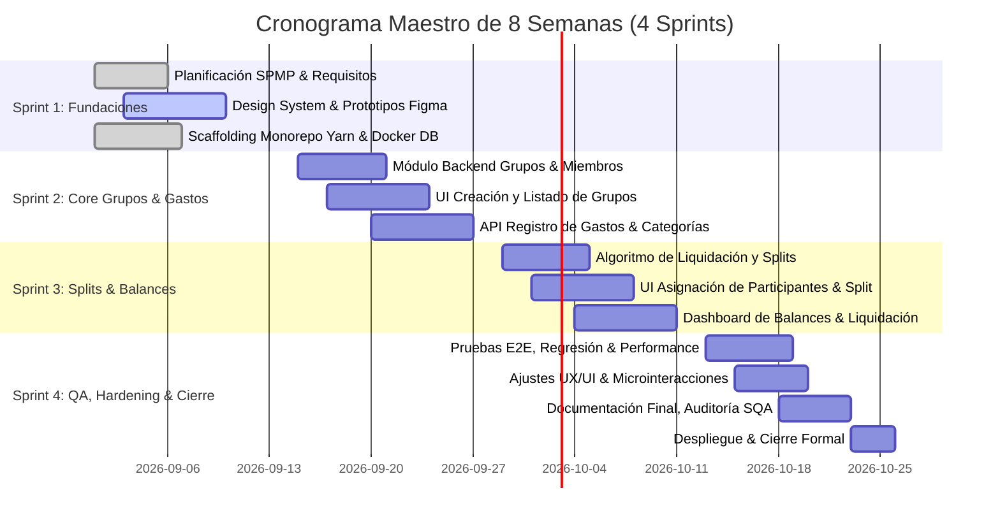

---

# Sección 4: Procesos Técnicos

### 4.1 Métodos, Herramientas y Técnicas
- **Frontend Stack:** React 18 / 19, Vite, TypeScript, TailwindCSS, Lucide React, Axios.
- **Backend Stack:** NestJS (Node.js LTS), TypeScript, TypeORM, MySQL 8.0, Class-Validator, Swagger OpenAPI 3.0.
- **Infraestructura:** Docker & Docker Compose para aislamiento de contenedores MySQL en entornos Linux/Dev.
- **Gestión de Paquetes:** **Yarn v1.22+ Classic Workspaces** (`apps/backend`, `apps/frontend`).
- **Diseño & Prototipado:** Figma (Componentes atómicos, Auto-layout, Variables de Color/Tipografía).
- **Control de Calidad:** Jest (Backend Unit/Integration), Vitest + React Testing Library (Frontend), Postman Collections.

### 4.2 Arquitectura del Sistema (Diagrama de Contenedores C4 - Nivel 2)

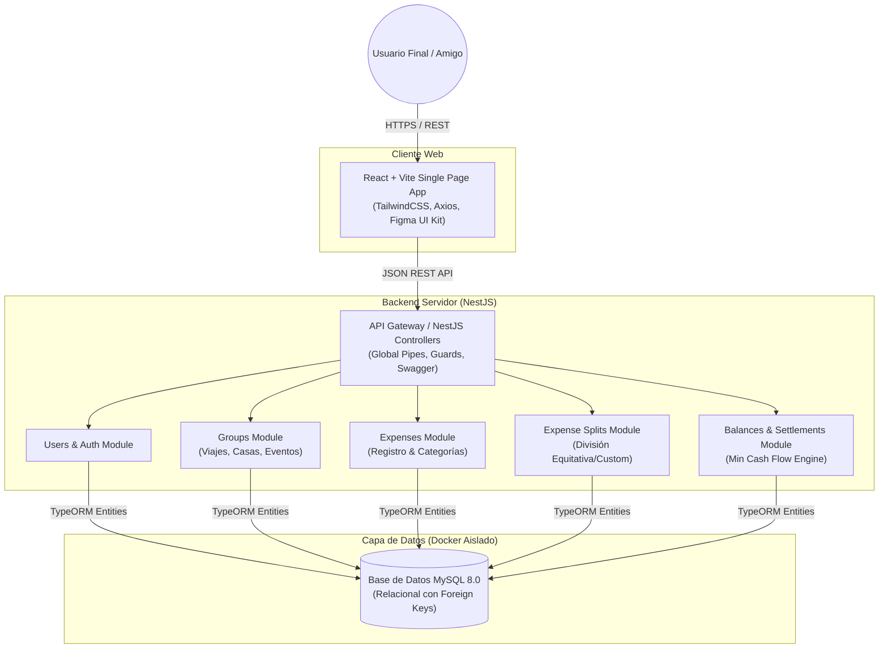

### 4.3 Modelado UML

#### 4.3.1 Diagrama de Casos de Uso del Sistema
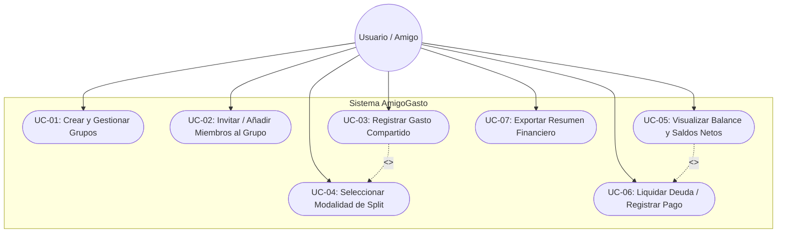

#### 4.3.2 Diagrama de Clases del Dominio
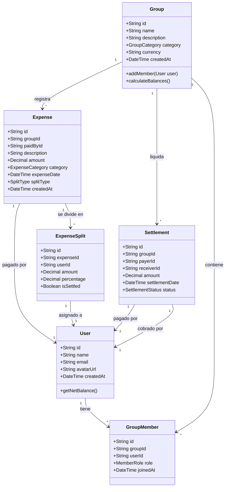

#### 4.3.3 Diagrama de Secuencia: Registro y Asignación de Gastos
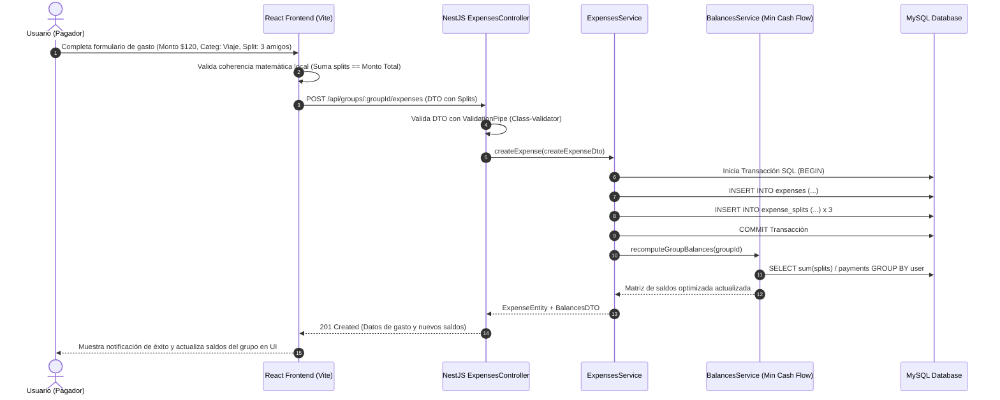

---

### 4.4 Modelado de Procesos de Negocio en Notación BPMN

#### 4.4.1 BPMN: Proceso de Creación y Configuración de Grupo
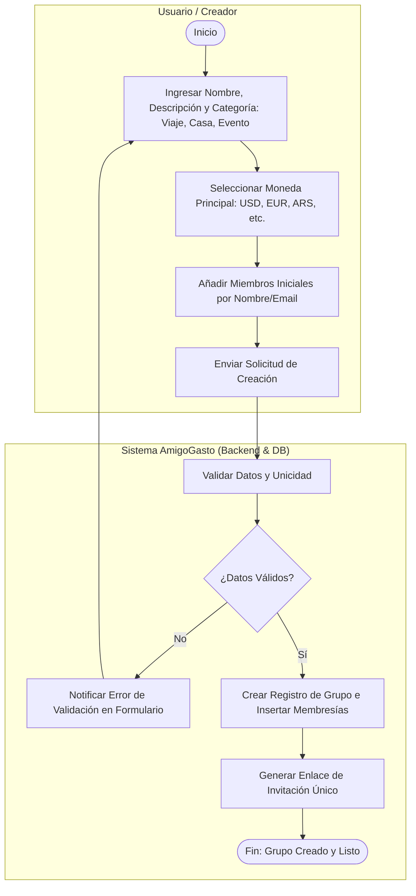

#### 4.4.2 BPMN: Proceso de Registro, División y Validación de Gasto
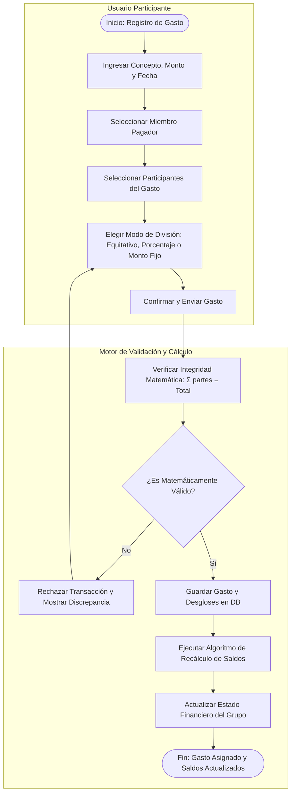

#### 4.4.3 BPMN: Proceso de Liquidación de Deudas (Min Cash Flow Settlement)
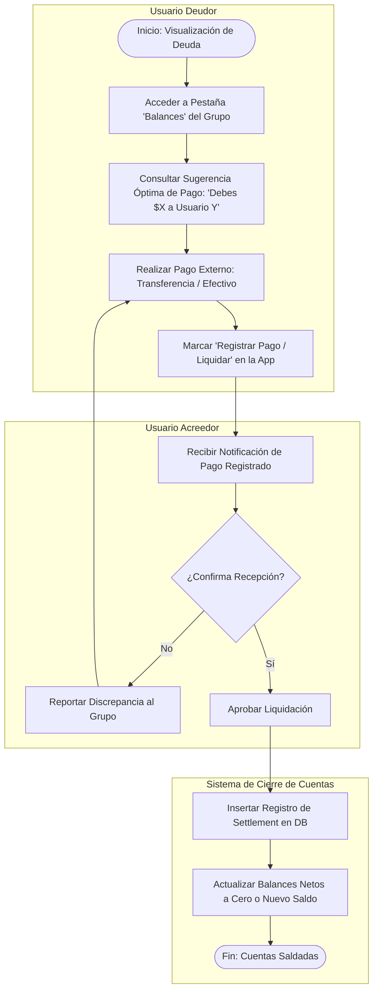

---

# Sección 5: Planificación de los Recursos

### 5.1 Estimación de Esfuerzo y Capacidad
- **Equipo Total:** 6 personas.
- **Duración:** 8 semanas (4 Sprints de 10 días hábiles cada uno = 40 días hábiles).
- **Capacidad Bruta:** 6 personas $\times 6$ horas productivas/día $\times 40$ días = **1,440 Horas Hombre (HH)**.
- **Factor de Foco (Focus Factor):** 0.75 (considerando ceremonias, reviews y contingencias).
- **Capacidad Neta Estimada:** **1,080 Horas Productivas** distribuidas en **180 Story Points (SP)** a razón de 6 horas/SP (promedio de 45 SP por Sprint).

### 5.2 Recursos de Hardware, Software y Licencias

| Recurso | Tipo | Especificación / Proveedor | Propósito | Costo Estimado |
| :--- | :--- | :--- | :--- | :--- |
| **Estaciones de Trabajo** | Hardware | Linux / macOS / Windows x64 (16GB RAM, 8 Cores) | Desarrollo, build y pruebas locales | Propio (BYOD) |
| **Figma Professional** | Software SaaS | Figma Enterprise / Education Plan | Diseño UI/UX, Design Tokens e integración | Licencia Educativa / $0 |
| **Docker Engine & Compose** | Software | Open Source Docker v24+ / Compose v2.20+ | Aislamiento de Base de Datos MySQL | Open Source ($0) |
| **Gestor de Paquetes** | Software | Yarn Classic (v1.22.22) Workspaces | Gestión unificada de monorepo | Open Source ($0) |
| **GitHub Enterprise / Org** | Plataforma | Repositorio Git con GitHub Actions CI | Control de versiones, issues y automatización | Tier Gratuito / $0 |
| **MySQL 8.0** | DBMS | Contenedor Oficial Oracle MySQL Linux | Persistencia relacional de datos | Open Source ($0) |

### 5.3 Asignación de Recursos por Sprint y Carga de Trabajo

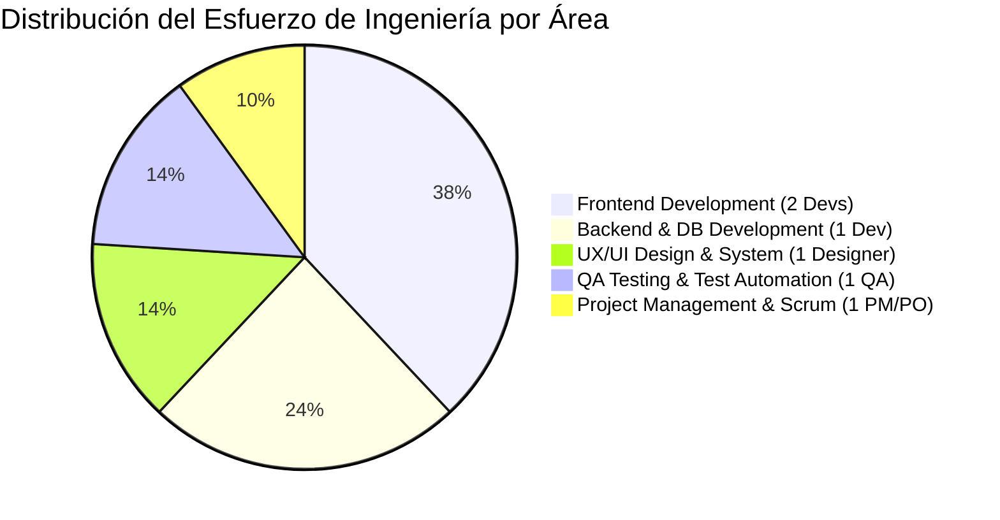

---

# Sección 6: Planificación de la Calidad (Software Quality Assurance - SQA)

### 6.1 Objetivos de Calidad basados en ISO/IEC 25010
Se establecen métricas cuantitativas obligatorias para cada característica de calidad:

| Característica ISO 25010 | Subcaracterística | Métrica / Indicador | Umbral de Aceptación (Target) |
| :--- | :--- | :--- | :--- |
| **Adecuación Funcional** | Completitud Funcional | Porcentaje de Requisitos del Backlog verificados | $100\%$ de HU del MVP operativas |
| **Exactitud Financiera** | Corrección Matemática | Discrepancia en sumatoria de splits vs. total de gasto | **$0.00$ de error** (Precisión a 2 decimales) |
| **Eficiencia de Desempeño** | Tiempo de Respuesta | Latencia en endpoint de cálculo de balances | $< 250\text{ ms}$ para grupos de hasta 50 miembros |
| **Usabilidad** | Reconocibilidad y Estética | Puntuación System Usability Scale (SUS) | $\ge 85 / 100$ puntos |
| **Confiabilidad** | Tolerancia a Fallos | Manejo de excepciones en API REST con códigos HTTP estándar | $100\%$ de respuestas estructuradas (RFC 7807) |
| **Mantenibilidad** | Modularidad y Testeo | Cobertura de código en lógica de negocio (Backend) | $\ge 80\%$ cobertura de líneas y ramas |

### 6.2 Estrategia de Pruebas (Pirámide de Testing)

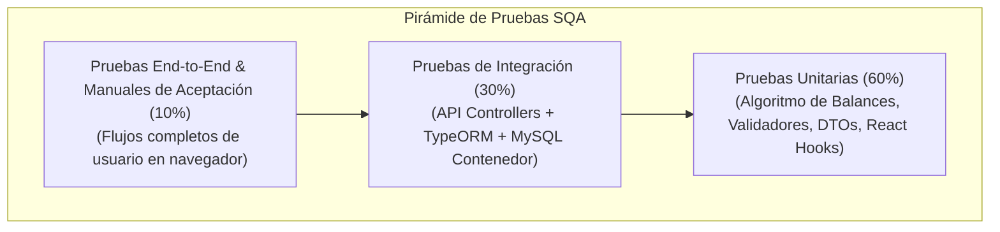

### 6.3 Plantilla Estándar de Casos de Prueba Funcionales (IEEE 829)

```markdown
ID de Caso de Prueba: TC-EXP-003
Título: División Equitativa de Gasto con Residuo de Centavos
Módulo: Gastos / Splits
Requisito Asociado: HU-04 (División de Gastos entre N Participantes)
Severidad: Crítica (Bloqueante)

Precondiciones:
1. Existe el grupo "Viaje a Bariloche" con 3 miembros activos: Juan, María y Pedro.
2. El usuario Juan tiene sesión iniciada.

Pasos de Ejecución:
1. Navegar al grupo "Viaje a Bariloche" y presionar "Nuevo Gasto".
2. Ingresar Monto: $100.00, Concepto: "Almuerzo", Pagador: "Juan".
3. Seleccionar los 3 participantes (Juan, María, Pedro) con Split "Equitativo".
4. Presionar "Guardar Gasto".

Resultado Esperado:
1. El gasto se guarda exitosamente con código HTTP 201.
2. Cada participante tiene asignado exactamente: Juan = $33.34, María = $33.33, Pedro = $33.33 (o ajuste de centavo consistente sin pérdida de dinero).
3. Sumatoria de splits = $100.00 exactos.
4. En balances: Juan tiene balance neto +$66.66; María debe $33.33 a Juan; Pedro debe $33.33 a Juan.

Estado: PASS / FAIL
Ejecutado por: Tester Funcional
```

### 6.4 Criterios de Aceptación Formales (DoR y DoD)

#### Definition of Ready (DoR) - Para entrar a un Sprint:
- [ ] Historia de usuario escrita en formato: *Como [rol], quiero [acción] para [beneficio]*.
- [ ] Criterios de aceptación detallados en formato Gherkin (*Given-When-Then*).
- [ ] Prototipo visual en Figma disponible y referenciado con componentes aprobados.
- [ ] Dependencias técnicas identificadas y resueltas.
- [ ] Estimada por el equipo en Story Points mediante Planning Poker.

#### Definition of Done (DoD) - Para considerar una Historia Terminada:
- [ ] Código implementado cumpliendo estándares de TypeScript y ESLint sin errores.
- [ ] Pruebas unitarias escritas y pasando exitosamente con cobertura $\ge 80\%$ del código nuevo.
- [ ] PR (Pull Request) revisado y aprobado por al menos 1 desarrollador par (Code Review).
- [ ] Integración verificada con base de datos MySQL en contenedor Docker.
- [ ] Pruebas funcionales manuales ejecutadas por el Tester QA con resultado *PASS*.
- [ ] Documentación OpenAPI / Swagger actualizada para nuevos endpoints.
- [ ] Incremento fusionado a la rama `develop` y probado en ambiente integrado.

---

# Sección 7: Planificación de la Comunicación

### 7.1 Matriz de Comunicaciones y Ceremonias Scrum

| Evento / Ceremonia | Frecuencia | Duración Máx. | Participantes | Objetivo / Output | Canal / Herramienta |
| :--- | :--- | :--- | :--- | :--- | :--- |
| **Sprint Planning** | Cada 2 semanas (Inicio de Sprint) | 2 horas | Todo el Equipo | Definir Sprint Goal y seleccionar Sprint Backlog | Google Meet / Jira Backlog |
| **Daily Standup** | Diaria (Lunes a Viernes 09:30) | 15 minutos | Todo el Equipo | ¿Qué hice ayer? ¿Qué haré hoy? ¿Qué bloqueos tengo? | Slack Huddle / Meet |
| **Refinamiento de Backlog** | Semanal (Miércoles) | 1 hora | PO, PM, Tech Leads | Clarificar y estimar HUs de futuros Sprints | Jira / Miro |
| **Sprint Review & Demo** | Cada 2 semanas (Fin de Sprint) | 1 hora | Todo el Equipo + Stakeholders | Demostración de software funcional terminado | Meet + Demo en vivo |
| **Sprint Retrospective** | Cada 2 semanas (Post Review) | 45 minutos | Todo el Equipo Scrum | Análisis de procesos, mejora continua y plan de acción | Miro / EasyRetro |

### 7.2 Protocolo de Escalamiento de Bloqueos (Blocker Escalation)
1. **Nivel 1 (Bloqueo Operativo < 4 horas):** Comunicación directa en canal `#dev-alerts` de Slack entre desarrolladores.
2. **Nivel 2 (Bloqueo Técnico/Requisitos > 4 horas):** Escalamiento inmediato al Scrum Master para remover impedimentos externos o coordinar sesión técnica emergente.
3. **Nivel 3 (Conflicto de Alcance / Plazo > 24 horas):** El Scrum Master convoca al Product Owner para realizar arbitraje y ajuste de prioridades del Sprint Backlog.

---

# Sección 8: Planificación de los Cambios y Configuración (SCM)

### 8.1 Gestión de Configuración y Estrategia de Ramas (Git Flow Adaptado)

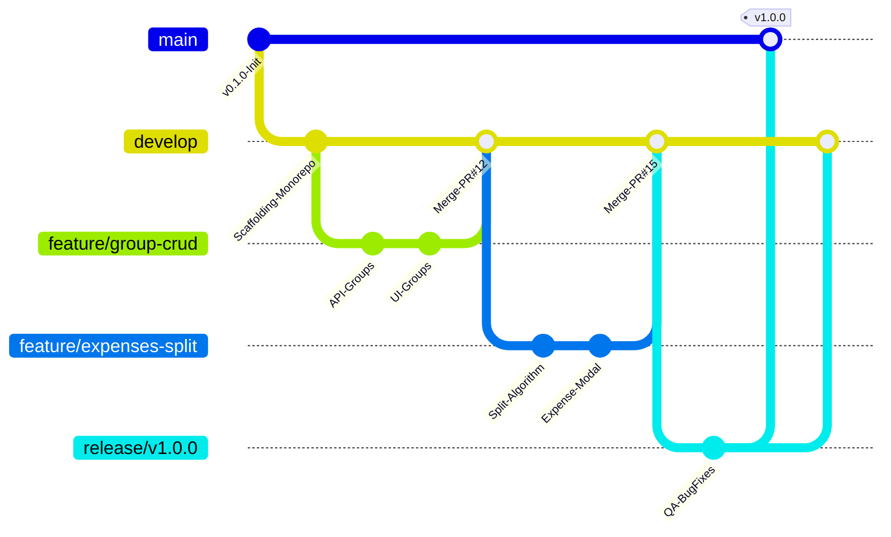

- **Rama `main`:** Código de producción estable, protegido contra push directo. Cada commit lleva un Git Tag SemVer (`v1.0.0`).
- **Rama `develop`:** Rama de integración continua de features completadas.
- **Ramas `feature/HU-[id]-[descripcion]`:** Ramas efímeras creadas desde `develop` para el trabajo de cada historia. Requieren Pull Request con revisión obligatoria.
- **Ramas `bugfix/` y `release/`:** Para estabilización de entregas y pruebas de regresión.

### 8.2 Proceso Formal de Solicitud de Cambio (RFC / Change Request)
Todo cambio propuesto que afecte el alcance, el diseño de arquitectura o el cronograma de 8 semanas debe seguir el siguiente flujo formal:

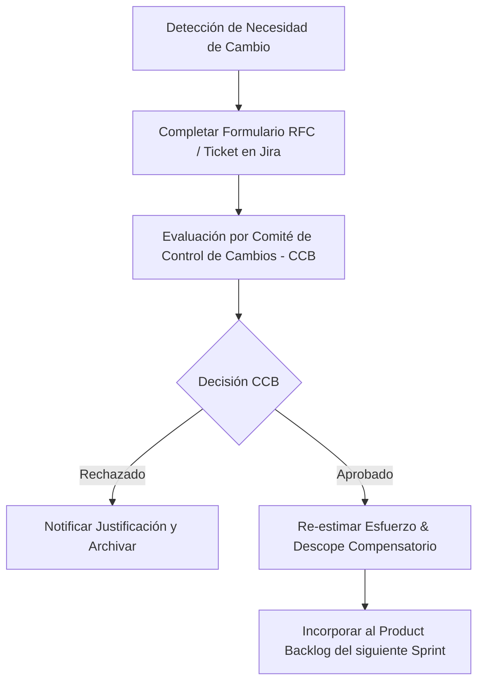

### 8.3 Comité de Control de Cambios (CCB - Change Control Board)
- **Miembros Permanentes:** Product Owner (Presidente), Project Manager / Scrum Master (Secretario), Backend Lead, Frontend Lead, QA Lead.
- **Criterio de Evaluación:** Impacto en el plazo de 8 semanas, valor de negocio aportado, impacto en la complejidad de arquitectura y deuda técnica.
- **Regla de Oro:** Ningún cambio de alcance entra al Sprint en curso; todo cambio aprobado reemplaza items de igual o menor valor en el Backlog futuro para no vulnerar el plazo contractual de 8 semanas.

### 8.4 Versionado Semántico (SemVer 2.0.0)
Se adopta la nomenclatura estándar `MAJOR.MINOR.PATCH`:
- **MAJOR (v1.0.0):** Incremento con cambios incompatibles en API o arquitectura principal.
- **MINOR (v1.1.0):** Incorporación de nueva funcionalidad retrocompatible (e.g. soporte de nuevas monedas o exportación a PDF).
- **PATCH (v1.0.1):** Corrección de bugs o parches de seguridad retrocompatibles.

---

**Fin del Documento SPMP — Aprobado para Ejecución del Proyecto SplitWise Collab / AmigoGasto.**
